

<h1>ZoinPark</h1>
<h3>A Full-Stack Web3-Inspired Investment & Community Platform</h3>

Built with <b>Next.js 16, React 19, MongoDB, NextAuth, Tailwind CSS, and Server Actions</b>.

 <a href="https://zoinpark.vercel.app/">🌐 Live Demo</a> • <a href="https://github.com/Rejoan2020/zoinpark">📂 Repository</a> 

<h2>Overview</h2>

ZoinPark is a modern full-stack investment dashboard that simulates the core features of a real-world Web3 platform.

The application enables users to securely create an account, stake virtual assets, participate in community events, complete weekly challenges, earn rewards, manage their wallet, track referrals, and receive email notifications.

<h2>Features</h2>

<h3>Authentication</h3>
<ul>
<li>User Registration</li>
<li>Secure Login</li>
<li>Protected Routes</li>
<li>Password Reset via Email</li>
<li>Change Password</li>
<li>Session Management using NextAuth</li>
</ul> 

<h3>User profile</h3>
<ul>
<li>Showing Profile information</li> 
<li>Edit profile</li>
<li>Change password</li>
</ul>

<h3>Weekly Challenges</h3>
<ul>
<li>Weekly challenge progress bar</li>
<li>Referral Challenges</li>
<li>Daily Check-in tracking</li>
<li>Visit ZoinPark for 5 Consecutive Days</li>
<li>Visit ZoinPark for 7 Consecutive Days</li>
<li>Staking challenges</li>
<li>Challenges of joining community programs</li>
<li>Reward Claiming</li>
<li>Automatic Weekly Reset Logic</li>
</ul>

<h3>Staking</h3>
<ul>
<li>Multiple Staking Packages</li>
<li>APY Calculation</li>
<li>Daily Profit Calculation</li>
<li>Staking History</li>
<li>Wallet Integration</li>
<li>Different Investment Ranges</li> 
</ul>

<h3>Community Events</h3>
<ul>
<li>Browse Upcoming Events</li>
<li>Register for Events</li>
<li>Email Confirmation</li>
<li>Duplicate Registration Prevention</li>
</ul>

<h3>Referral System</h3>
<ul>
<li>Unique Referral Codes</li>
<li>Referral Tracking</li>
<li>Referral Rewards</li> 
</ul>

<h3>Invite and Earn</h3>
<ul>
<li>Invite through a unique relferral link</li>
<li>Invite by Email</li>
<li>Automatic invitaion rewards if the invitation is accepted</li> 
</ul>

<h3>Zoin calculations</h3>
<ul>
<li>Total zoin after any transaction</li>
<li>Total debit credit calculations</li>
<li>Total transaction history</li>
<li>Seperate staking history & daily withdraw system</li> 
<li>Search by ID in transaction history, staking history</li>
</ul>

<h3>Help and Support</h3>
<ul>
<li>Community access with Whatsapp, Telegram</li>
<li>Reach by Email</li>
<li>Ticket submission</li> 
<li>Ticket resopnse management</li> 
<li>Search by ticket ID</li> 
<li>Admin announcement</li>
<li>Amin announcement management</li>
</ul>

<h2>Tech Stack</h2>

<h3>Frontend</h3>
<ul>
<li>Next.js 16</li>
<li>React 19</li>
<li>Tailwind CSS</li>
<li>JavaScript (ES6+)</li>
</ul>

<h3>Backend</h3>
<ul>
<li>Next.js Server Actions</li>
<li>MongoDB Atlas</li>
<li>Mongoose ODM</li>
<li>NextAuth.js for authentication</li>
<li>Resend API for Email</li>
</ul>

<h3>Deployment</h3>
<ul>
<li>Vercel</li>
<li>MongoDB Atlas</li> 
</ul>

<h2>📂 Project Structure</h2>

<code> 
zoinpark/
│
├── app/
│   ├── actions/                  # Server Actions
│   ├── api/                      # API Routes
│   ├── (auth)/                   # Authentication pages
│   │   ├── signin/
│   │   ├── signup/
│   │   ├── forgetpassword/
│   │   ├── resetpassword/
│   │   └── components/
│   │
│   ├── (dashboard)/              # Protected Dashboard
|   |   ├──(menu)
│   │      ├── dashboard/
│   │      ├── helpandsupports/
│   │      ├── notifications/
│   │      ├── staking/
│   │      ├── tokens/
│   │      ├── zoi/
│   │   ├── [user]/settings
│   │              ├── changepassword/
|   |              ├── components
|   |              ├── edit-profile
|   |              └── profile
│   │
│   ├── components/               # Shared UI Components
│   ├── layout.js
│   └── page.js
│
│
├── lib/                          # Database & External Services
│   ├── mongo.js 
│   ├── mail.js
│   └── client.js
│
├── models/                       # Mongoose Models
|   ├── Announcement.js
│   ├── User.js
│   ├── Wallet.js
│   ├── WalletTransaction.js
│   ├── StakePackage.js
│   ├── UserStake.js
│   ├── Event.js
│   ├── EventRegistration.js
│   ├── Referral.js
│   ├── weeklyChallenge.js
│   ├── userWeeklyChallenge.js
│   ├── Notification.js
│   ├── Ticket.js
│   └── PasswordResetToken.js
│
├── public/                       # Static Assets
│   ├── icons/
│   ├── images/
│   └── events/
│
├── scripts/                      # Database Seed Scripts
│   ├── seedEvents.js
│   └── seedPackages.js
│
├── utils/                        # Helper Functions
│
├── screenshots/                  # README Screenshots
│
├── .env.local
├── package.json
├── tailwind.config.js
├── next.config.js
└── README.md 
</code>

<h2>Database Models</h2>
<ul>
<li>Announcement</li>
<li>Event</li>
<li>EventRegistration</li>
<li>Notification</li>
<li>PasswordResetToken</li>
<li>Referral</li>
<li>StakePackage</li>
<li>Ticket</li>
<li>User</li>
<li>UserStake</li>
<li>userWeeklyChallenge</li>
<li>Wallet</li>
<li>WalletTransaction</li>
<li>weeklyChallenge</li>
</ul>

<h2>Screenshots</h2>

<h3>In larger device</h3>
<table>
<tr>
<td align="center">
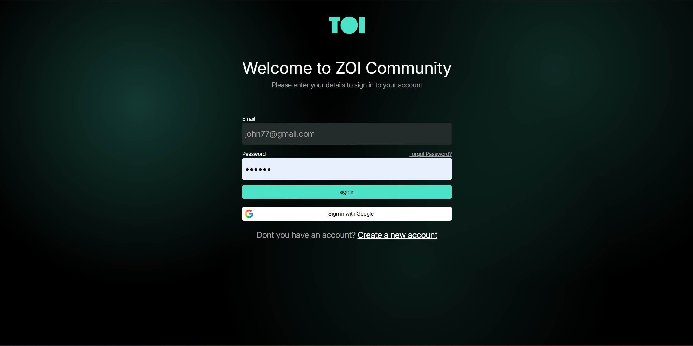 
<b>Login</b>
</td>

<td align="center">
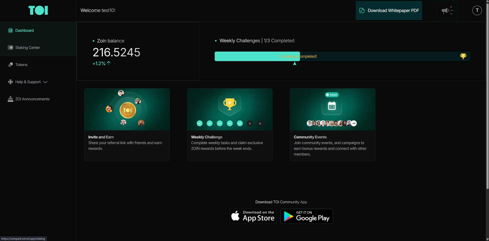 
<b>Dashboard</b>
</td>
</tr>

<tr>
<td align="center">
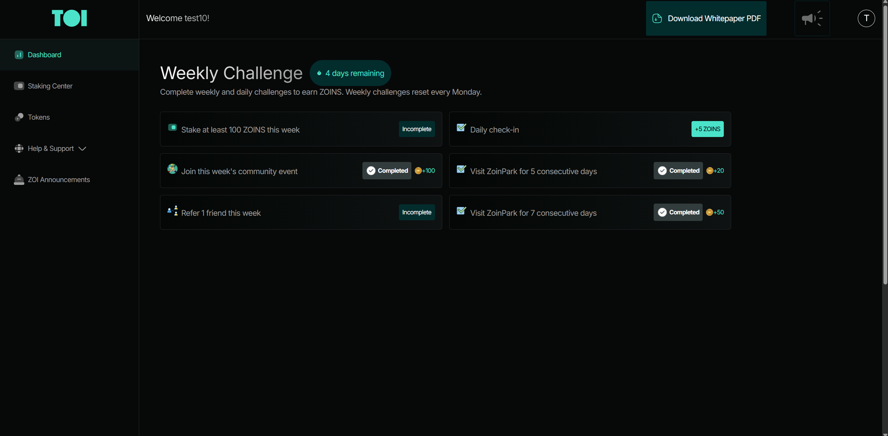 
<b>Weekly Challenges</b>
</td>

<td align="center">
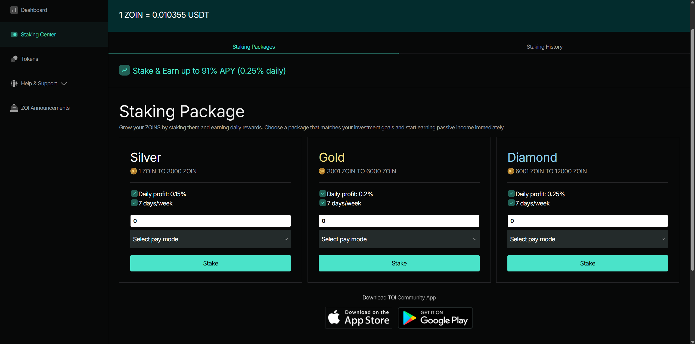 
<b>Staking</b>
</td>
</tr>

<tr>
<td align="center">
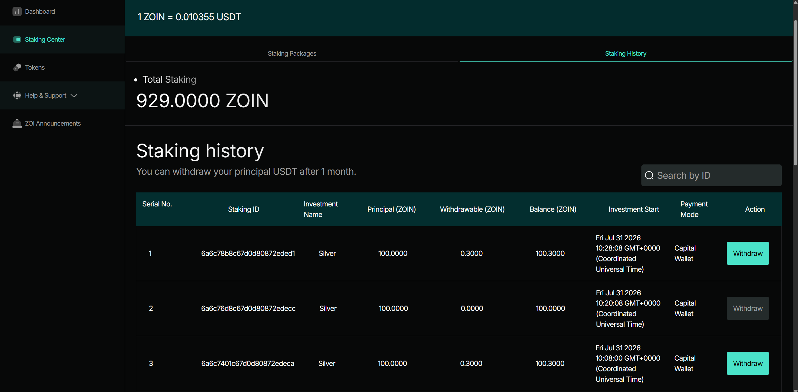 
<b>Staking History</b>
</td>

<td align="center">
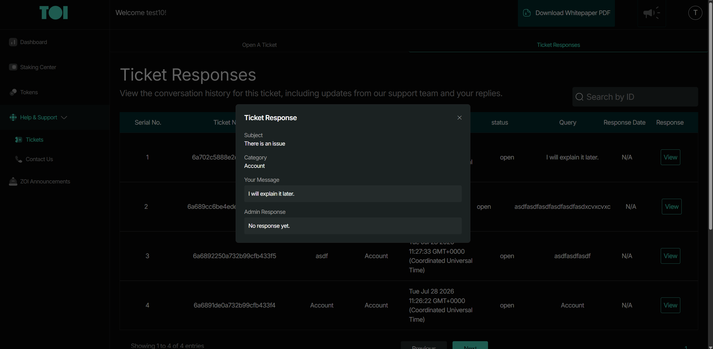 
<b>Ticket Response</b>
</td>
</tr>
<tr>
<td align="center">
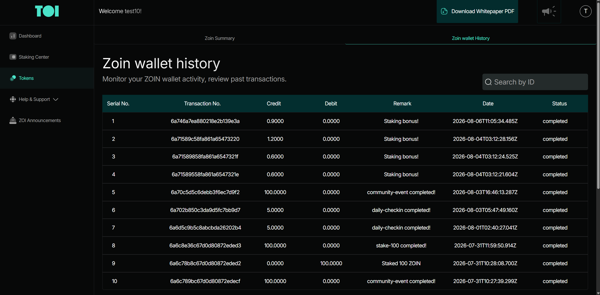 
<b>Wallet</b>
</td>
</tr>

</table>

<h3>In smaller devices</h3>

<table> <tr> <td align="center"> 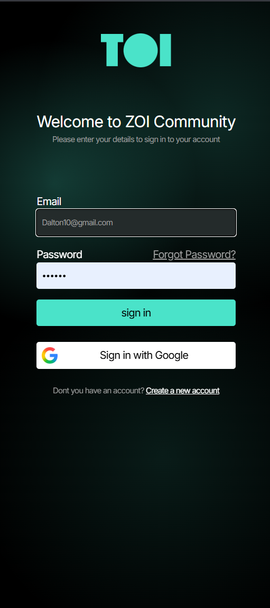  <b>Login</b> </td> <td align="center"> 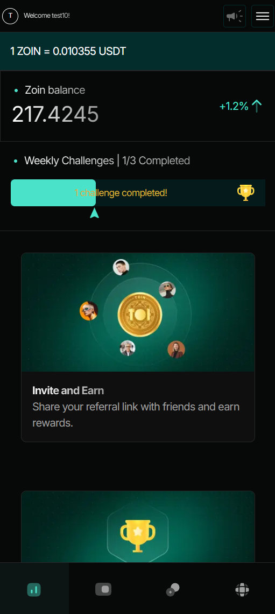  <b>Dashboard</b> </td> <td align="center"> 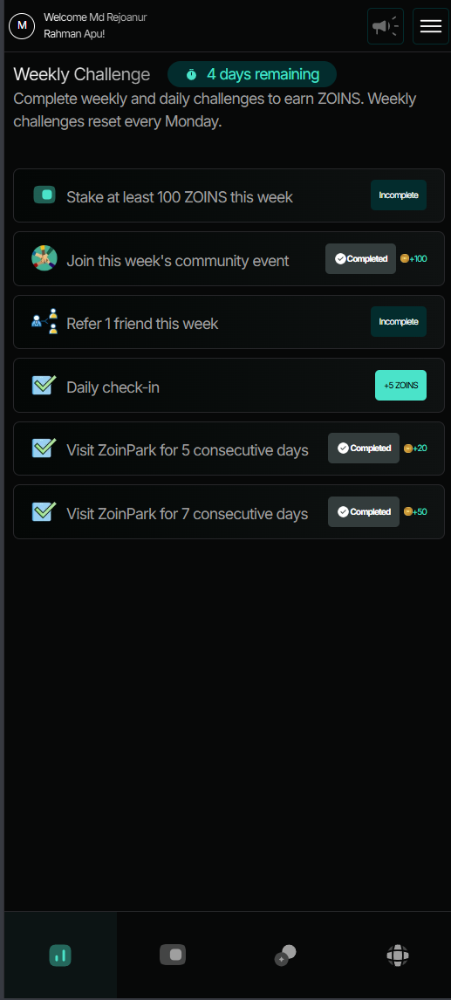  <b>Weekly Challenges</b> </td> <td align="center"> 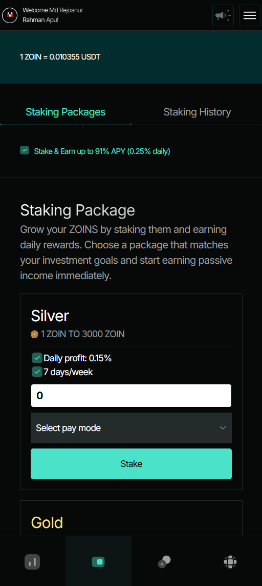  <b>Staking Packages</b> </td> </tr> <tr> <td align="center"> 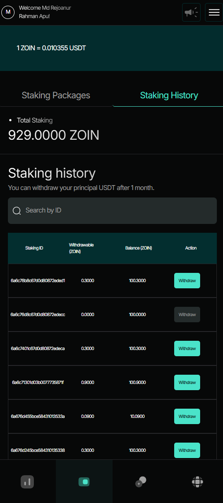  <b>Staking History</b> </td> <td align="center"> 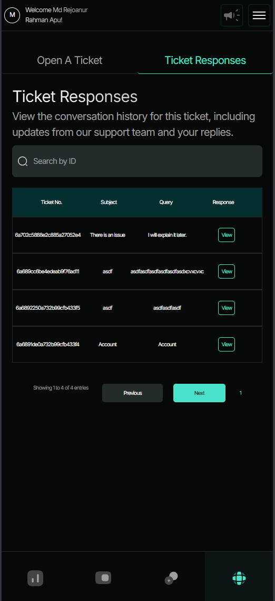  <b>Ticket Response</b> </td> <td align="center"> 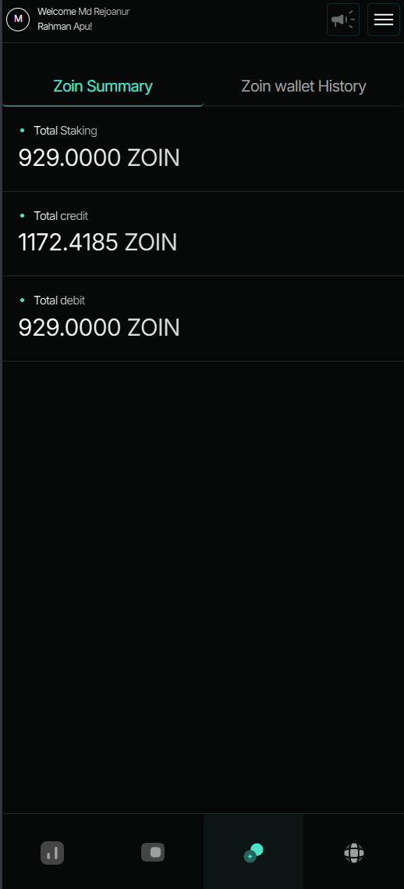  <b>Wallet</b> </td> </tr> </table>

<h2>⚙️Installation</h2>

<code>
Clone the repository

git clone https://github.com/Rejoan2020/zoinpark.git

Go inside the project

cd zoinpark

Install dependencies

npm install

Create a .env.local
MONGODB_URI= 

AUTH_SECRET=
AUTH_GOOGLE_ID=
AUTH_GOOGLE_SECRET=
RESEND_API_KEY=

NEXTAUTH_URL = 

Run the development server

npm run dev
</code>

<h2>Production Features</h2>
<ul>
<li>Responsive Design</li>
<li>Server Components</li>
<li>Client Components</li>
<li>Server Actions</li>
<li>Secure Authentication</li>
<li>Database Validation</li>
<li>Error Handling</li>
<li>Email Notifications</li>
<li>Scalable Folder Structure</li>
<li>Reusable Components</li>
<li>Optimized Images</li>
<li>Protected Routes</li>
</ul>

<h2>Engineering Highlights</h2>

During development, special attention was given to:
<ul>
<li>Designing scalable MongoDB schemas</li>
<li>Maintaining wallet transaction integrity</li>
<li>Preventing duplicate event registrations</li>
<li>Tracking consecutive-day challenge progress</li>
<li>Secure authentication using NextAuth</li>
<li>Reusable component architecture</li>
<li>Responsive UI across devices</li>
<li>Server-side rendering where appropriate</li>
<li>Efficient database queries using Mongoose</li>
</ul>

<h2>Future Improvements</h2>
<ul>
<li>Payment Gateway Integration</li>
<li>Admin Dashboard</li>
<li>Push Notifications</li>
<li>Real Cryptocurrency Deposits</li>
<li>Two-Factor Authentication (2FA)</li>
<li>Multi-language Support</li>
</ul>

<h2>Contributing</h2>

Contributions, issues, and feature requests are welcome.

Feel free to fork the repository and submit a pull request.

<h2>📄 License</h2>

This project is licensed under the MIT License.

⭐ If you found this project interesting, consider giving it a star! 

